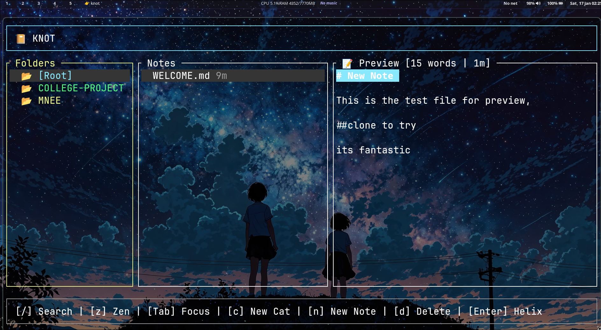

# 📔 Knot

**Knot** is a lightning-fast, terminal-based Markdown note manager built with Rust. It provides a structured, categorized environment for your thoughts, designed to integrate seamlessly with the **Helix** editor.

!

## ✨ Features

* **Categorized Storage:** Organizes notes into sub-folders with a 6-color cycling palette.
* **Rainbow Markdown:** Automatic syntax highlighting for headings (`H1` through `H4`).
* **Live Stats:** Real-time word count and estimated reading time.
* **Zen Mode:** Press `z` to hide the sidebars and focus entirely on your content.
* **Helix Integration:** Open any note instantly in Helix and return to Knot upon closing.
* **Instant Search:** Fuzzy-style filtering for both categories and note titles.

---
Key,Action
Tab,Switch focus between Folders and Notes
j / k,Navigate Up / Down lists
Enter / e,Open selected note in Helix
/,Filter categories and notes
n,Create a new Note in the current folder
c,Create a new Category (Folder)
d,Delete selected item (with confirmation)
z,Toggle Zen Mode
q,Quit Knot
---
## 🛠 Installation

### Prerequisites
* **Rust** (Cargo)
* **Helix Editor** (Command must be available as `helix`)

### Setup
1. Clone this repository:
   ```bash
   git clone [https://github.com/ethical-buddy/knot.git](https://github.com/ethical-buddy/knot.git)
   cd knot

Contributor Guide

I love contributions! To keep the code clean and the UI snappy, please follow these guidelines:

    Fork & Branch: Create a feature branch (git checkout -b feature/cool-new-thing).

    Keep it TUI-first: Knot is a terminal tool. Avoid dependencies that require heavy graphical overhead.

    Code Style: Run cargo fmt before committing.

    UI Consistency:

        Use the palette array in main.rs for new UI elements to keep colors consistent.

        Ensure all new modes (like NewNote) have a corresponding InputMode variant.

    Submit: Open a Pull Request with a clear description of the change.

Development Roadmap

    [ ] Custom keybinding support via a .toml config.

    [ ] Interactive Markdown checklists (- [ ]).

    [ ] Note tagging and global "grep" search across all folders.
